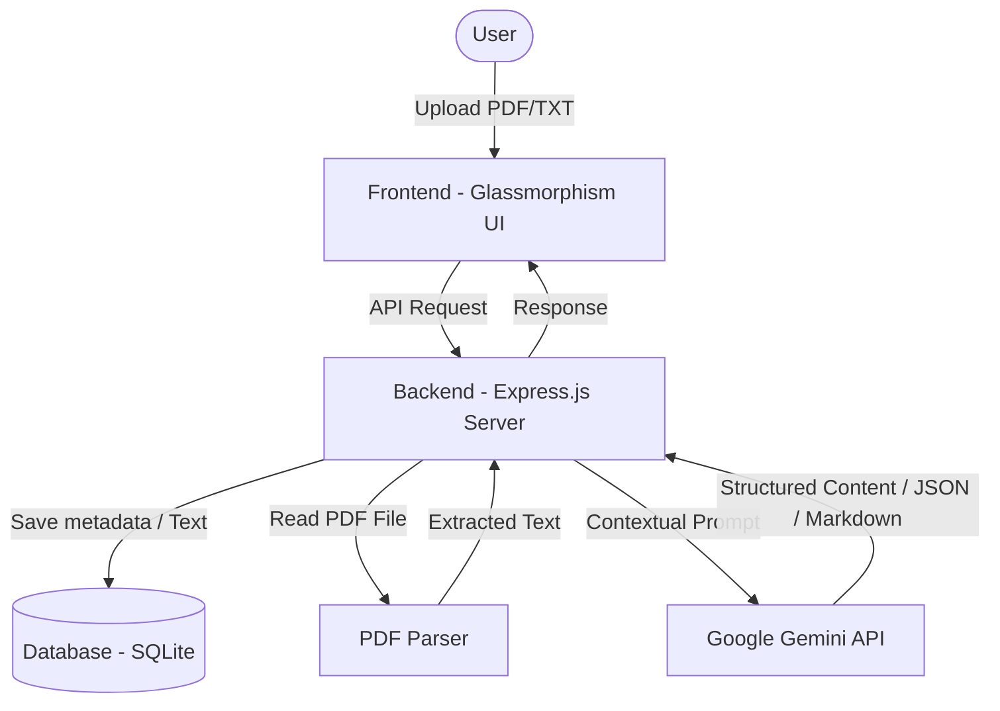

# 🧠 AI-Powered Study Buddy (NotebookLM Inspired)

An interactive, AI-powered study platform designed to transform dense study materials (PDFs and Text files) into structured learning resources. Inspired by the Google NotebookLM workflow, it leverages the **Google Gemini API** to summarize content, generate interactive quizzes, build digital flashcard decks, and support contextual AI chat grounded directly in your uploaded source files.

---

## 🎨 Key Features

*   **📄 Document Ingestion:** Upload multiple study materials in PDF or TXT format (supports up to 50MB per file upload).
*   **📝 Automated Summarization:** Instantly generate concise, high-level summaries and key takeaways of your documents.
*   **🧠 Dynamic Quiz Generation:** Automatically build interactive, multiple-choice quizzes complete with scoring, visual feedback, and explanations for correct/incorrect answers.
*   **🃏 Flashcard Decks:** Generate flip-animated digital flashcards to test memory and boost retention through active recall.
*   **💬 Grounded Contextual Chat:** Engage in a conversation with an AI assistant that answers questions *exclusively* based on the context of your uploaded files (avoiding generic LLM hallucinations).
*   **✨ Premium Dark Mode Glassmorphism UI:** A sleek, fully responsive user interface featuring micro-animations, glassmorphism card layouts, and intuitive controls.
*   **🗄️ Local Persistence:** Fast, lightweight session-based accounts using an embedded SQLite database to persist users, uploads, and study progress locally.

---

## 🛠️ Technology Stack

*   **Frontend:** HTML5, Custom Vanilla CSS3 (Glassmorphism layout, transitions, responsive flexbox/grid), Vanilla JavaScript (Single-Page App interactivity, async API calls).
*   **Backend:** Node.js, Express.js (REST API, file-upload parsing, session management).
*   **Database:** SQLite (via `better-sqlite3` for high-performance synchronous queries).
*   **PDF Parsing:** `pdf-parse` (raw text extraction).
*   **AI Integration:** Google Gemini API (`@google/generative-ai` SDK, utilizing `gemini-2.0-flash-lite` or configured model).
*   **Session Management:** `express-session` for stateful local user sessions.

---

## ⚙️ Project Architecture & Workflow



1.  **Ingestion:** The user uploads a TXT or PDF file. PDF contents are parsed and extracted by `pdf-parse`.
2.  **Storage:** Extracted text is indexed and persisted inside the SQLite database under a unique source ID.
3.  **Prompt Engineering:** Predefined prompt templates dynamically wrap the retrieved document text, directing the AI to generate structured outputs (e.g. strict JSON lists for quizzes and flashcards).
4.  **AI Generation:** The Gemini SDK processes the prompt, constraints, and context, generating a targeted response.
5.  **Parsing and Rendering:** The server processes the response, sending structured data to the frontend to render quizzes, flashcard animations, summaries, or chat logs.

---

## 🚀 Getting Started

Follow these steps to set up the project and run it locally.

### 📋 Prerequisites

Make sure you have the following installed on your machine:
*   [Node.js](https://nodejs.org/) (v16 or higher recommended)
*   [npm](https://www.npmjs.com/) (usually packaged with Node.js)
*   A Google Gemini API key (Get a free key from the [Google AI Studio](https://aistudio.google.com/app/apikey))

### 📥 Installation

1.  **Clone the Repository:**
    ```bash
    git clone https://github.com/Rutuja-131005/StudyBuddy.git
    cd StudyBuddy
    ```

2.  **Install Dependencies:**
    ```bash
    npm install
    ```

3.  **Configure Environment Variables:**
    Create a `.env` file in the root directory (or duplicate and rename `.env.example`):
    ```bash
    cp .env.example .env
    ```
    Open the `.env` file and add your actual Gemini API key:
    ```env
    GEMINI_API_KEY=your_actual_gemini_api_key_here
    SESSION_SECRET=a_secure_random_string_for_sessions
    PORT=3000
    ```

### 🏃 Running the Application

*   **Development Mode (Auto-reloads on file changes):**
    ```bash
    npm run dev
    ```
*   **Production / Standard Mode:**
    ```bash
    npm start
    ```

Once started, open your web browser and navigate to:
```
http://localhost:3000
```

---

## 🔒 Security & Best Practices

*   **Credentials & Secrets:** The `.env` file contains your local session secrets and API credentials. **Never commit the `.env` file to git.** It is included in the `.gitignore` by default.
*   **Local Data Security:** User passwords are encrypted using `bcryptjs` before storage in the local database.
*   **Database Files:** SQLite database files (`study_buddy.db`, `study_buddy.db-wal`, `study_buddy.db-shm`) are kept locally and are excluded from git commits.

---

## 🤝 Contributing

Contributions are welcome! Please feel free to open issues or submit pull requests.
1. Fork the project.
2. Create your feature branch (`git checkout -b feature/AmazingFeature`).
3. Commit your changes (`git commit -m 'Add some AmazingFeature'`).
4. Push to the branch (`git push origin feature/AmazingFeature`).
5. Open a Pull Request.

---

## 📄 License

Distributed under the MIT License. See `LICENSE` for more information (if applicable).
